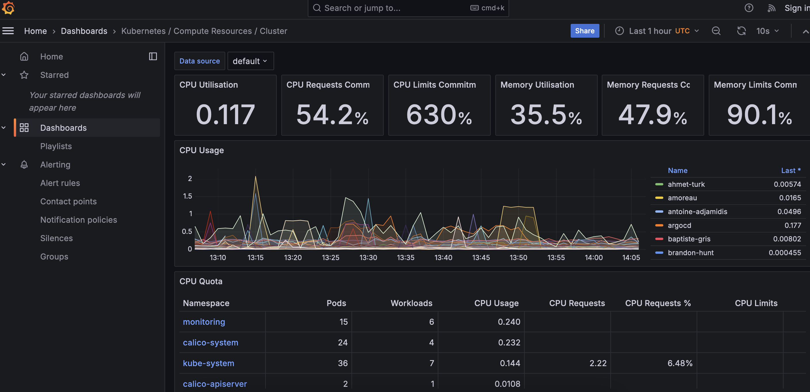
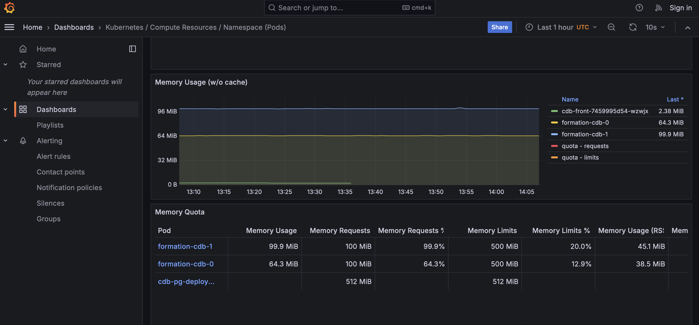
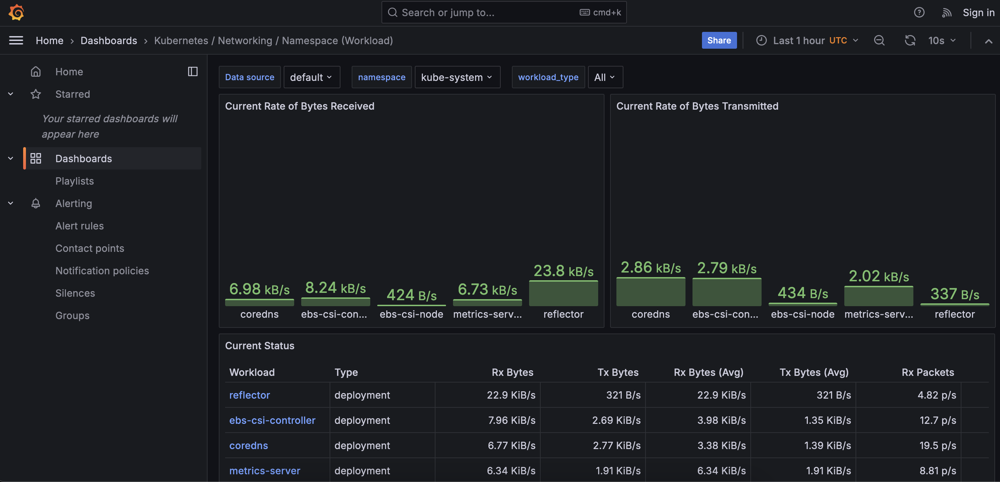
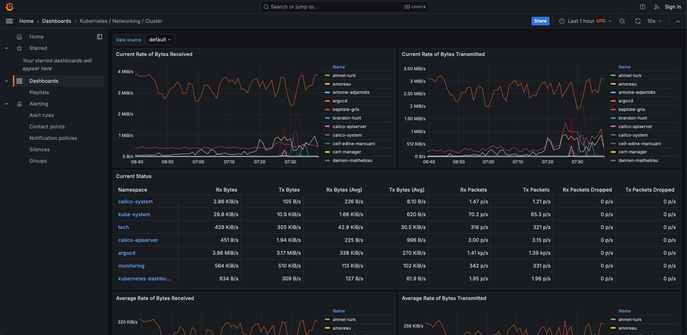

# Day 4 - Monitoring

## Avec cette approche : Quelle est le rôle de Prometheus ? Quelle est le rôle de Grafana ?

Rôle de Prometheus
Prometheus est un système de surveillance et d'alerte open-source. 
Dans le contexte d'un cluster Kubernetes (k8s), Prometheus est utilisé pour :

- Collecter des métriques de performance et d'état des pods, des nœuds et d'autres composants du cluster.
- Stocker ces métriques dans une base de données de séries temporelles.
- Offrir des capacités de requête pour analyser les données collectées.
- Définir des alertes basées sur les métriques collectées pour notifier les administrateurs en cas de problèmes.

Rôle de Grafana:
Grafana est une plateforme open-source de visualisation et d'analyse de métriques. Dans le contexte d'un cluster Kubernetes, Grafana est utilisé pour :
- Créer des tableaux de bord interactifs et visuellement attrayants pour afficher les métriques collectées par Prometheus.
- Permettre aux utilisateurs de surveiller en temps réel l'état et les performances du cluster.
- Faciliter l'analyse des tendances et l'identification des problèmes potentiels grâce à des graphiques et des visualisations personnalisables.
- En résumé, Prometheus collecte et stocke les métriques, tandis que Grafana les visualise et les analyse

## Récupérez un état des lieux des ressources CPU et RAM utilisé ou requise au niveau du cluster Kubernetes entier

Home > Dashboards > Kubernetes / Compute resources / Cluster 

## Récupérez le graphe de la RAM utilisée sur votre propre namespace

## Récupérez un état des lieux de la bande passante utilisé au niveau du cluster Kubernetes entier

## Récupérez le monitoring de l'espace utilisé par votre volume persistant de votre base de données (ou le volume primaire dans le cas où vous utilisez l'operator postgreSQL)
Home / Dashboards / Kubernetes / Persistent Volumes

